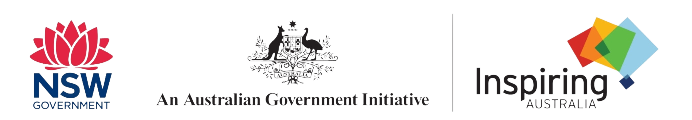
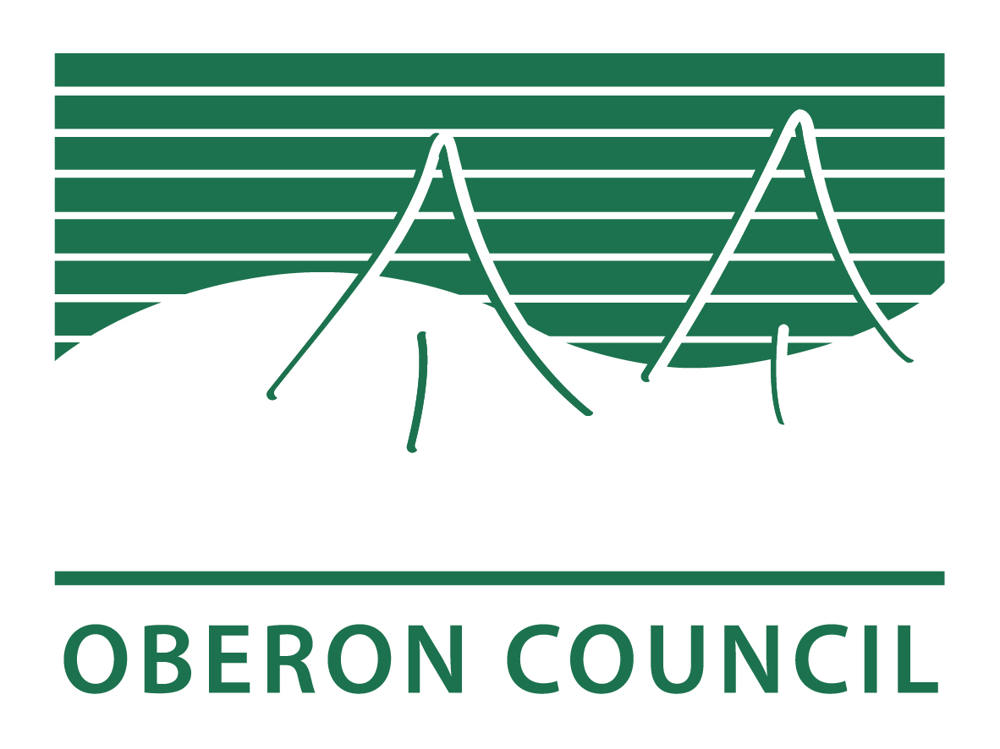

## Saturday, 15th August 2026 at the Malachi Gilmore Hall, Oberon, NSW

To mark National Science Week 2026, Oberon Citizen Science Network is proud to present this free community event, **"Science in Oberon: More than you imagine"**, at the [Malachi Gilmore Hall](https://malachigilmorehall.com.au) in Oberon on Saturday, 15th August 2026.

::: {.callout-note}
This [Inspiring Australia NSW](https://inspiringnsw.org.au) initiative is supported by the Australian Government as part of [National Science Week](https://www.scienceweek.net.au). Oberon Citizen Science Network also gratefully acknowledges support for this event by [Oberon Council](https://www.oberon.nsw.gov.au/Home) through its Section 356 community funding scheme.

::: {layout="[[80, 20]]"}

{fig-align="center"}

{fig-align="center" width=150}
:::

:::

::: {.aside}

:::

::: {.aside}

 to go to event booking page)](assets/event-page-qr-code-ScienceinOberon-Morethanyouimagine.png)

:::

## 15th August 2026 event at the Malachi Gilmore Hall, Oberon

| Time     | Item                                   | Presenter |                      
|---------:|:----------------------------------------------------------|:------|
| 10:00 am | Exhibition of science-related projects, demonstrations and posters | |	
| 11:30 am | Prizes awarded for school biodiversity colouring-in competition | |	
| 12:00 pm | Soup and bread roll ($10 per person) available | |
| 12:30	pm | Andrew McKibbin, Mayor of Oberon _Official opening of event_ | |
| 12:35 pm | Aunty Ruby Dykes _Acknowledgement of Country & biobanking at Tricketts Arch Biodiversity Site Aboriginal Corporation_ | |	 
| 12:45	pm | Tim Churches, OCSN Co-founder & President _Introduction to OCSN and its activities, goals and plans_ | |
| 1:05	pm | Dr Ana Gracanin, Research Fellow, Australian National University Fenner School of Environment & Society _Greater gliders and other arboreal marsupials: ecology and conservation_ | | 	
| 1:35	pm | Jackson Wilburn Wilkes, PhD candidate, School of Biological, Environmental and Earth Sciences (BEES), University of NSW _Effects of climate change on platypus populations in the Fish and Duckmaloi Rivers near Oberon_ | |
| 2:00	pm | Malan Bothma, PhD candidate, School of Biological, Environmental and Earth Sciences (BEES), University of UNSW _The effects of wind farms on Australian bird species -- what we know and what we don't know_ |  | 	
| 2:25	pm | An interactive scientific musical interlude | | 
| 2:35	pm | Afternoon tea _Tea, coffee and light refreshments available (free)_ |  |
| 2:50	pm | Alan Sheehan, OCSN	Co-founder & Public Officer _Eco-acoustics for biodiversity assessment_ |  |
| 3:10	pm | Dr Anne Musser, Jenolan Caves Trust and NPWS _Biodiversity at Jenolan Karst Conservation Reserve, with a special look at platypus research_ |  |
| 3:35	pm | Various speakers _Closing remarks_ | |
| 3:45 pm | End of event | |
| 4:00 pm | Hall closes| |
