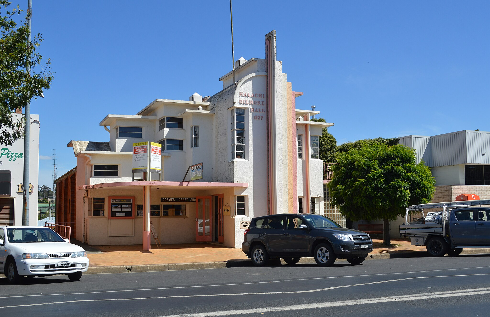

## Saturday, 15th August 2026 at the Malachi Gilmore Hall, Oberon, NSW

To mark National Science Week 2026, Oberon Citizen Science Network is proud to present this free community event, **"Science in Oberon: More than you imagine"**, at the [Malachi Gilmore Hall](https://malachigilmorehall.com.au) in Oberon on Saturday, 15th August 2026.

::: {.callout-note}
This [Inspiring Australia NSW](https://inspiringnsw.org.au) initiative is supported by the Australian Government as part of [National Science Week](https://www.scienceweek.net.au). Oberon Citizen Science Network also gratefully acknowledges support for this event by [Oberon Council](https://www.oberon.nsw.gov.au/Home) through its Section 356 community funding scheme.

::: {layout="[[80, 20]]"}

{fig-align="center"}

{fig-align="center" width=150}
:::

:::

::: {.aside}

:::

::: {.aside}

 to go to event booking page)](assets/event-page-qr-code-ScienceinOberon-Morethanyouimagine.png)

:::

::: {.aside}
The National Science Week 2026 event in Oberon will be held at the wonderful _art deco_ [Malachi Gilmore Hall](https://malachigilmorehall.com.au) in co-operation with its owners, Lucy and Johnny East. The Malachi Gilmore Hall is an architectural gem that looks like it has just landed from Outer Space, despite being built in 1932.

:::

## 15th August 2026 event at the Malachi Gilmore Hall, Oberon

| Start Time | Item                                   |                       
|---------:|:----------------------------------------------------------|
| 10:00 am | Exhibition of science-related projects, demonstrations and posters _Please see list of exhibits below_ |	
| 11:30 am | School biodiversity colouring-in competition |	
| 12:00 pm | Soup and bread roll ($10 per person) available |
| 12:30	pm | Andrew McKibbin, Mayor of Oberon _Official opening of event_ |
| 12:35 pm | Aunty Ruby Dykes _Acknowledgement of Country & biobanking at Tricketts Arch Biodiversity Site Aboriginal Corporation_ |	 
| 12:45	pm | Tim Churches, OCSN Co-founder & President _Introduction to OCSN and its activities, goals and plans_ |
| 1:05	pm | Dr Ana Gracanin, Research Fellow, Australian National University Fenner School of Environment & Society _Greater gliders and other arboreal marsupials: ecology and conservation_ | 	
| 1:35	pm | Jackson Wilburn Wilkes, PhD candidate, School of Biological, Environmental and Earth Sciences (BEES), University of NSW _Effects of climate change on platypus populations in the Fish and Duckmaloi Rivers near Oberon_ |
| 2:00	pm | Malan Bothma, PhD candidate, School of Biological, Environmental and Earth Sciences (BEES), University of UNSW _The effects of wind farms on Australian bird species -- what we know and what we don't know_ | 	
| 2:25	pm | An interactive scientific musical interlude | 
| 2:35	pm | Afternoon tea _Tea, coffee and light refreshments available (free)_ |
| 2:50	pm | Alan Sheehan, OCSN	Co-founder & Public Officer _Eco-acoustics for biodiversity assessment_ |
| 3:10	pm | Dr Anne Musser, Jenolan Caves Trust and NPWS _Biodiversity at Jenolan Karst Conservation Reserve, with a special look at platypus research_ |
| 3:35	pm | Various speakers _Closing remarks_ |
| 3:45 pm | End of event |
| 4:00 pm | Hall closes|

## List of Exhibits 

The Malachi Gilmore Hall will be open to public on Saturday 15th August 2026 to view the exhibits from 10am to 12:30pm. A series of talks (please see program above) will commence at 12:30pm. Admission for both the exhibits and the talks is free.

The planned exhibits include:

* a banner by by artist Karly Fowler showing life-size illustrations of many  Australian native bat species
* School Colouring Competition
* an interactive kinetic sound sculpture by Lucy East
* OCSN seismic monitoring equipment and analyses of earthquakes both near and far detected by our monitors located near Oberon, including a live view display of OCSN seismic monitoring stations R21C0 and R5969, and a tablet computer demonstrating ShakeNet app that can used to view them and other seismic monitors around the world
* infrared and thermal wildlife cameras designed and constructed by OCSN to detect platypus and rakali in the headwaters of rivers around Oberon, with a live view from a thermal camera, and excerpts of nocturnal videos captured by this equipment
* a live demonstration of a _Chladni plate_, illustrating resonant frequencies in metal plates 
* Birdweather demo showing OCSN stations and bird detections.
* demonstration of Audiomoth mic driving the Audiomoth live app for eco-acoustic detection
* various stereo and electronic microscopes allowing examination of butterfly and moth wings and other natural specimens of interest
* light traps for nocturnal insects
* a display of nature photography in the Oberon region by Warren Lloyd
* displays and demonstration of various electronic test equipment (more details soon)

