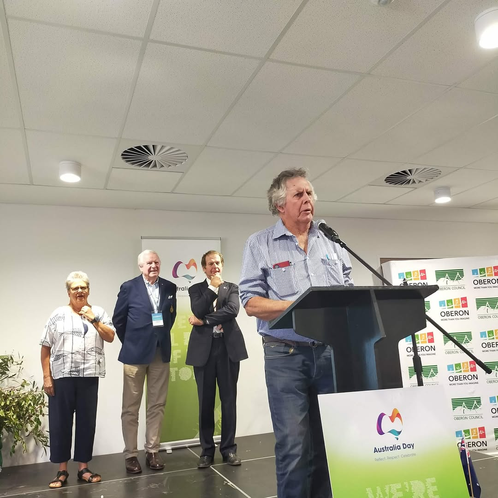
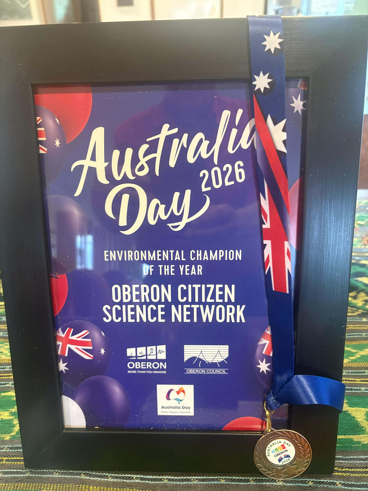

Oberon Citizen Science Network (OCSN) is pleased to report that it was presented with the  **Environmental Champion of the Year** award by Oberon Council on Australia Day, 26 January 2026. We sincerely thank Oberon Council for this award, and Mayor McKibben for his kind and positive comments about our work at the awards ceremony. We also thank OCSN member Malcolm Graham for representing OCSN at the event and accepting the award, and for speaking briefly about our activities aat the ceremony. We also thank the anonymous person who nominated OCSN for this award.

::: {layout-ncol=2}

:::
