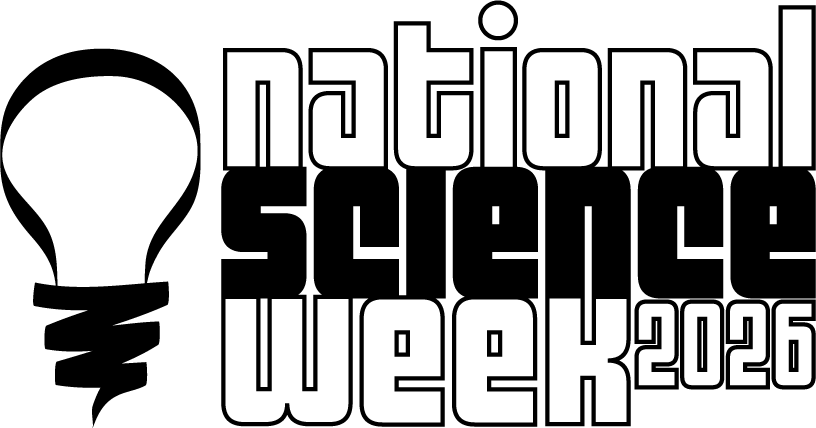
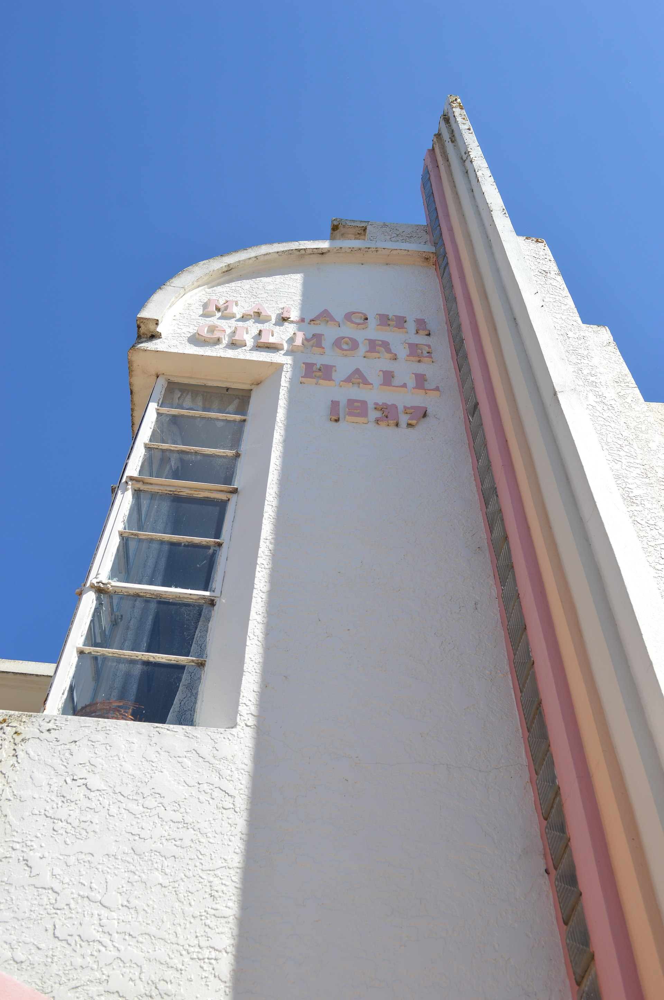

::: {.aside}

:::

We are pleased to announce that a grant proposal for a community event in Oberon during National Science Week 2026 which Oberon Citizen Science Network recently submitted to Inspiring Australia NSW was successful! As a result, there will be a free event at the Malachi Gilmore Memorial Hall in Oberon on Saturday 15 August, 2026, the first day of National Science Week 2026. 

::: {.aside}

:::

Full details of the program for the event will be publicised in due course, but broadly there will be a number of exhibits of local scientific endeavours open to the public in the Malachi Gilmore Hall from about 11am, followed by a series of talks by visiting scientific experts in a number of disciplines, as well as by OCSN members on our activities and research findings.

The OCSN event as well as other National Science Week 2026 events which have been funded by Inspiring Australia NSW are listed [here](https://inspiringnsw.org.au/2026/03/02/announcing-the-2026-nsw-national-science-week-grant-recipients/).

We sincerely thank Lucy and Johnny East, owners of the Malachi Gilmore Memorial Hall, for agreeing to host the event and for their collaboration on the grant proposal, and Debra Keane, Tourism and Economic Development Manager at Oberon Council, for her enthusiastic support for the proposal.

::: {layout-ncol=2}

:::
