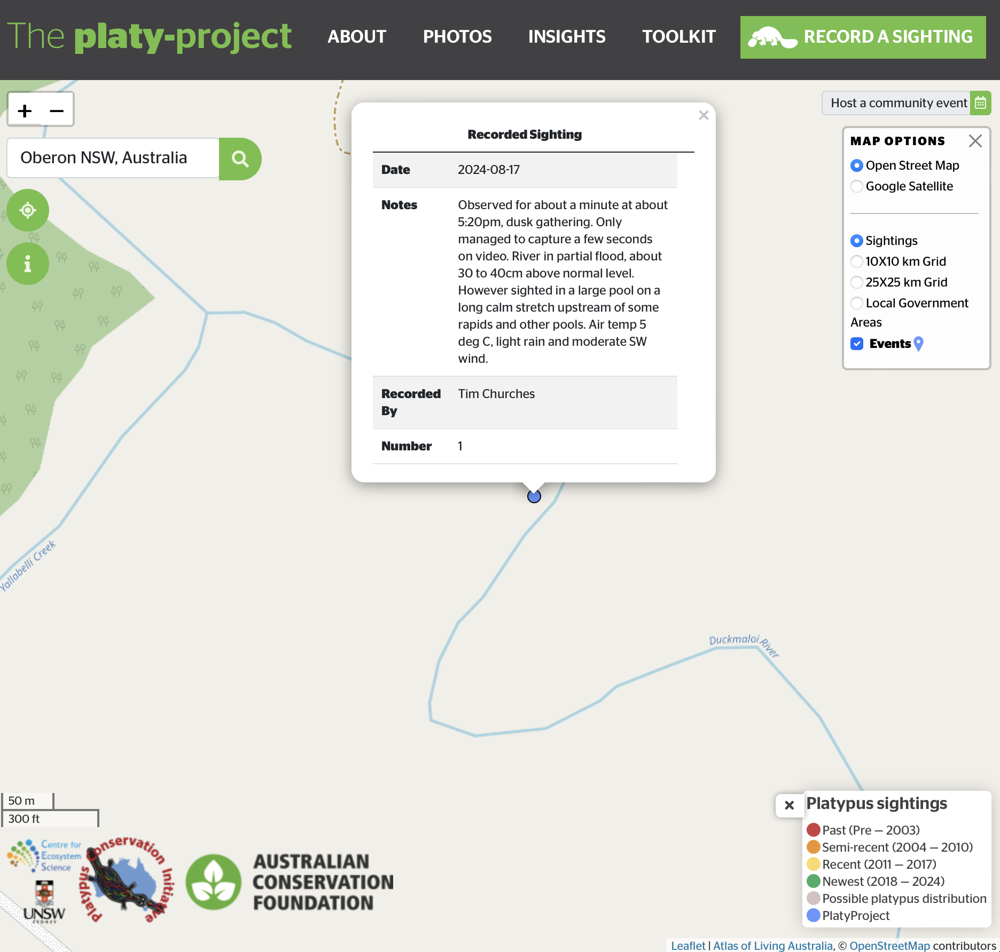
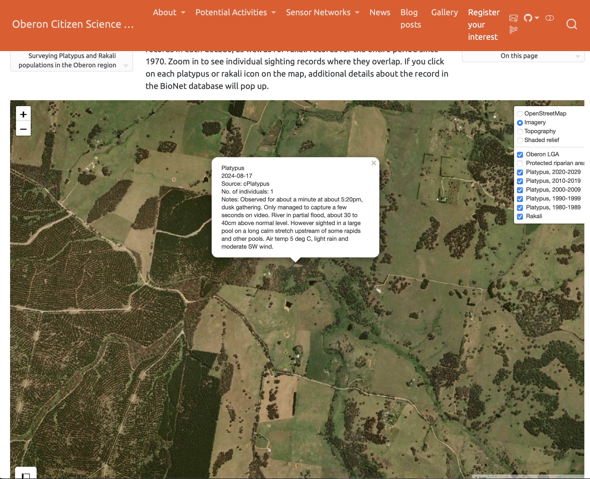
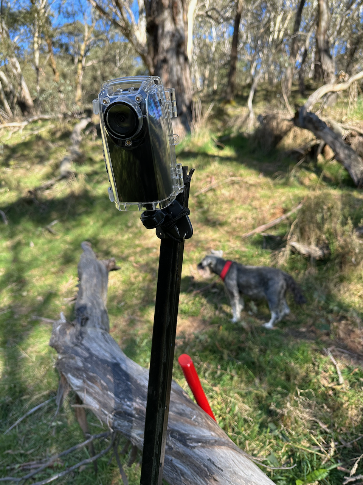
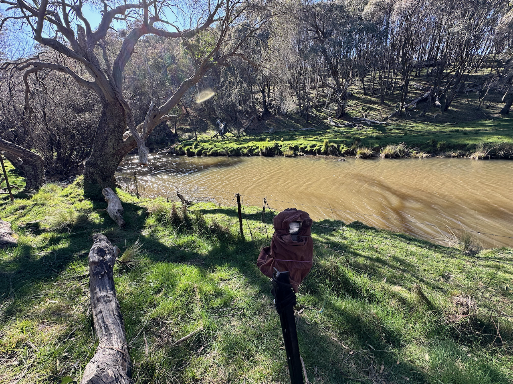

::: {.callout-note title="Current status of this initiative"}
Just a test of mapping biodiversity using ALA to compare with BioNet with respect to various maps shown in the Oberon Council 2026 Oberon Housing Strategy consultation document.
:::


## Introduction

Anecdotally, rivers in the Oberon region used to be famous for their abundant platypus populations -- in fact, there is a story, probably apocryphal, that [the name of the Duckmaloi River](https://www.abc.net.au/news/2017-12-07/curious-central-west-place-town-name-meanings-origins/9228070), which runs through Oberon LGA, came from the surprised exclamation of Irish settlers on first encountering a platypus: "Duck-mole-oy!" ("oy" being what you said if you wanted someone to agree with you). Certainly a lot of research last century into the extent and behaviours of the platypus was conducted in river systems around Oberon by researchers associated with Taronga Zoo and various NSW universities -- copies of some scientific papers and reports on platypus in the Duckmaloi River, several by local resident Amanda MacLeod, can be accessed [here](assets/AM98287.pdf), [here](assets/AM98319.pdf) and [here](assets/AM98306.pdf).

::: {.aside}

A rakali (Australian native water rat, scientific name _Hydromys chrysogaster_) caught on a trail camera camera deployed in Stone Creek, O'Connell by Kyla Ries



:::

Much less is known about the extent in the Oberon region of the [_rakali_](https://en.wikipedia.org/wiki/Rakali), also also known as the _rabe_, the _"Australian Otter"_ or _native water-rat_, (scientific name _Hydromys chrysogaster_). This elusive creature lives in burrows on the banks of rivers, lakes and estuaries and feeds on aquatic insects, fish, crustaceans, mussels, snails, frogs, bird's eggs and small water birds -- and thus, it often shares similar habitats to the platypus, hence its inclusion here.

::: {.callout-note title="ABC News article on the elusive rakali"}

A recent article published by ABC News on the rakali, and a call for citizen scientists to log sightings of it, is available [here](https://www.abc.net.au/news/2024-07-02/rakali-water-rat-researcher-urges-citizen-science-help/104043350). This is something which OCSN members intend to get involved in!
:::

::: {.aside}
There are several time-lapse camera videos showing the results of platypus and rakali surveillance in the upper Duckmaloi River on our [Gallery page](ocsn_gallery.html).
:::

## NSW BioNet Atlas records of platypus and rakali sightings or trappings in Oberon LGA

BioNet is a database of flora and fauna information collected over many decades from multiple sources, operated by the NSW Department of Planning and Environment (DPE). The role of BioNet is described by the DPE thus:

> BioNet aims to improve biodiversity outcomes by enabling the community and government to proactively manage and enhance biodiversity in New South Wales through comprehensive, credible and robust data and information.

It is also important because threatened and endangered species records in BioNet must be used by assessors of proposed developments in order to avoid or minimise impacts on wildlife, and is also used as part of the [Biodiversity Assessment Method](https://www.environment.nsw.gov.au/-/media/OEH/Corporate-Site/Documents/Animals-and-plants/Biodiversity/biodiversity-assessment-method-2020-200438.pdf) (BAM), which is used as part of the **legislated** Biodiversity Offsets Scheme (currently under review due to [numerous flaws found by the Audit Office of NSW](https://www.audit.nsw.gov.au/our-work/reports/effectiveness-of-the-biodiversity-offsets-scheme)).

::: {.callout-note}
The data shown below were manually downloaded from the NSW government BioNet database on 18 February 2025. It is intended to convert these charts and maps to automatically update once a week with the latest data from BioNet once an API access key has been obtained.
:::

The chart below shows the trend in platypus and rakali records in BioNet. These trends may reflect frequency of observations and survey efforts as much as declines or fluctuations in the animal populations or extents. This is an issue which OCSN hopes to address over the next few years by mounting regular, systematic surveys of platypus and rakali activity in key water courses in Oberon LGA, using a combination of direct observation and time-lapse camera recordings (see below). Note that there are very few observations of rakali. This may be because they are rare, but also because they are elusive -- but see the video of a rakali captured by OCSN committee member Kyla Ries on this page.

```{r}
#| echo: false
#| message: false
#| warning: false
#| include: false

library(tidyverse)
library(sf)
library(clock)

load("assets/red_list.RData")

```

```{r}
#| echo: false
#| message: false
#| warning: false
#| include: false


# download data for all fauna in Oberon SLA from https://atlas.bionet.nsw.gov.au/UI_Modules/ATLAS_/AtlasSearch.aspx
# bionet_oberon <- read_tsv("assets/Atlas_records_20240924-170940/Atlas_records_dfy0dp51xksxkltuxbt4izzs20240924-170937.txt", skip=4)

# bionet_oberon <- read_tsv("assets/Atlas_records_20250218-140347/Atlas_records_eoiugh2zo1aekxlxom5wzh2w20250218-140340.txt", skip=4)

# bionet_oberon <- read_tsv("assets/Atlas_records_20251202-093101/Atlas_records_2ukuovc5aevm1kkp222rz3hy20251202-093058.txt", skip=4)

bionet_oberon <- read_tsv("assets/Atlas_records_20260222-165304/Atlas_records_3uts2dxuehhxml2alptj0d3b20260222-165258.txt", skip=4) |>
  separate_wider_delim(ScientificName, delim = " ", names = c("genus_name", "species_name"),
                       too_many = "drop")

# NSWStatus and CommStatus codes
# Source for code definitions: https://hdp-au-prod-app-nsw-haveyoursay-files.s3.ap-southeast-2.amazonaws.com/7917/4666/6726/ziph33.pdf

# Key: 
# 2 = Category 2 sensitive species
# P = Protected 
# 3 = Category 3 sensitive species
# V = Vulnerable 
# C = China-Australia Migratory Bird Agreement
# E = Endangered 
# J = Japan-Australia Migratory Bird Agreement
# E1 = Endangered Species
# K = Republic of Korea-Australia Migratory Bird Agreement
# E4A = Critically Endangered Species


bionet_oberon_filtered_sf <- bionet_oberon %>% 
                        mutate(NSW_status = case_when(
                          NSWStatus == "E1" ~ "Endangered",
                          NSWStatus == "E1,P" ~ "Endangered, Protected",
                          NSWStatus == "E1,P,2" ~ "Endangered, Protected, Category 2",
                          NSWStatus == "E1,P,3" ~ "Endangered, Protected, Category 3",
                          NSWStatus == "E4A,P,2" ~ "Critically Endangered, Protected, Category 2",
                          NSWStatus == "P" ~ "Protected",
                          NSWStatus == "V,P" ~ "Vulnerable, Protected",
                          NSWStatus == "V,P,2" ~ "Vulnerable, Protected, Category 2",
                          NSWStatus == "V,P,3" ~ "Vulnerable, Protected, Category 3",
                          .default = "Nil"),
                              Comm_status = case_when(
                          CommStatus == "E" ~ "Endangered",
                          CommStatus == "CE" ~ "Endangered",
                          CommStatus == "J" ~ "Japan-Australia Migratory Bird Agreement",
                          CommStatus == "V" ~ "Vulnerable",
                          CommStatus == "C,J,K" ~ "China/Japan/Korea-Australia Migratory Bird Agreements",
                          CommStatus == "V,C,J,K" ~ "Vulnerable, China/Japan/Korea-Australia Migratory Bird Agreements",
                          .default = "Nil")) |>
                        mutate(NSW_status_condensed = case_when(
                          NSW_status == "Endangered" ~ "Endangered",
                          NSW_status == "Endangered, Protected" ~ "Endangered",
                          NSW_status == "Endangered, Protected, Category 2" ~ "Endangered, Category 2",
                          NSW_status == "Endangered, Protected, Category 3" ~ "Endangered, Category 3",
                          NSW_status == "Critically Endangered, Protected, Category 2" ~ "Critically endangered, Category 2",
                          NSW_status == "Protected" ~ "Protected",
                          NSW_status == "Vulnerable, Protected" ~ "Vulnerable",
                          NSW_status == "Vulnerable, Protected, Category 2" ~ "Vulnerable, Category 2",
                          NSW_status == "Vulnerable, Protected, Category 3" ~ "Vulnerable, Category 3",
                          .default = "Nil"),
                              Comm_status_condensed = case_when(
                          Comm_status == "Endangered" ~ "Endangered",
                          Comm_status == "Japan-Australia Migratory Bird Agreement" ~ "Migratory Bird Agreement",
                          Comm_status == "Vulnerable" ~ "Vulnerable",
                          Comm_status == "China/Japan/Korea-Australia Migratory Bird Agreements" ~ "Migratory Bird Agreement",
                          Comm_status == "Vulnerable, China/Japan/Korea-Australia Migratory Bird Agreements"  ~ "Migratory Bird Agreement",
                          .default = "Nil")) |>
                        left_join(red_list, by=join_by(genus_name, species_name)) |>
                        mutate(
                              red_list_category_condensed = case_when(
                          red_list_category == "Critically Endangered" ~ "Critically Endangered",
                          red_list_category == "Data Deficient" ~ "Data Deficient",
                          red_list_category == "Endangered" ~ "Endangered",
                          red_list_category == "Extinct" ~ "Extinct",
                          red_list_category == "Least Concern" ~ "Least Concern",
                          red_list_category == "Lower Risk/conservation dependent" ~ "Lower Risk",
                          red_list_category == "Lower Risk/least concern" ~ "Lower Risk",
                          red_list_category == "Lower Risk/near threatened" ~ "Lower Risk",
                          red_list_category == "Near Threatened" ~ "Near Threatened",
                          red_list_category ==  "Vulnerable" ~ "Vulnerable",
                          .default = "Nil")) |>                          
                        filter(Status != "Invalid, in quarantine") |>
                          # filter(red_list_code %in% c('CR', 'EN', 'NT', 'VU')) |>
                        mutate(ScientificName = paste(genus_name, species_name)) |>
                        select(CommonName, ScientificName, KingdomName,
                               DateFirst,DateLast,
                               Latitude_GDA94,Longitude_GDA94,Accuracy,
                               NumberIndividuals, Description, SightingNotes,
                               LocationNotes, NSW_status, Comm_status,
                               red_list_code, red_list_category,
                               NSW_status_condensed, Comm_status_condensed,
                               red_list_category_condensed) %>%
                        mutate(DateFirst = clock::date_parse(DateFirst,
                                                             format="%d/%m/%Y"),
                               DateLast = clock::date_parse(DateLast,
                                                            format="%d/%m/%Y"),
                               Year = year(DateLast),
                               Decade = paste0(stringr::str_sub(as.character(Year), 1, 3),
                                               "0-",
                                                stringr::str_sub(as.character(Year), 1, 3),
                                                "9"),
                               PopupContent = paste(sep = "<br/>",
                                                    ScientificName,
                                                    CommonName,
                                                    paste0(DateFirst, " to ", DateLast),
                                                    paste0("NSW status: ", NSW_status),
                                                    paste0("Commonwealth status: ", Comm_status),
                                                    paste0("IUCN Red List status: ", red_list_category),
                                                    paste0("No. of individuals: ", NumberIndividuals),
                                                    paste0("Spatial accuracy (metres): ", Accuracy),
                                                    paste0("Location notes: ",
                                                           LocationNotes),
                                                    paste0("Description: ", Description),
                                                    paste0("Notes: ", SightingNotes))) %>%
                        st_as_sf(coords = c("Longitude_GDA94", "Latitude_GDA94"),
                                crs = "GDA94")

oberon_boundary <- sf::read_sf("assets/nsw-lga-boundaries.geojson") %>%
                      filter(abb_name == "Oberon")

oberon_boundary_buffered <- oberon_boundary |>
  st_buffer(dist=1000)

protected_riparian <- sf::st_read("assets/VulnerableLandsProtectedRiparian")

oberon_boundary_buffered_gda94 <- st_transform(oberon_boundary_buffered,                                             crs=st_crs(protected_riparian))

oberon_protected_riparian <- st_filter(protected_riparian, oberon_boundary_buffered_gda94)

```

```{r}
#| echo: false
#| message: false
#| warning: false

bionet_oberon_filtered_sf %>%
  filter(year(DateLast) > 1990, !NSW_status_condensed %in% c("Protected", "Nil")) %>%
  ggplot(aes(x=year(DateLast), fill=NSW_status_condensed)) +
           geom_bar(position = position_dodge2(preserve = "single")) +
  theme_minimal() +
  theme(legend.title=element_blank()) +
  labs(x="Year of observation",
       y="Number of observations",
       title="Observations by NSW conservation status (condensed) in Oberon LGA",
       subtitle = "NSW BioNet Atlas data as at 22 Feb 2026")

```

As can be seen, the small number of records, particularly recent records, for platypus and rakali in BioNet is a bit disappointing, and distressing. However there is a more inclusive source of biodiversity data we can query.

::: {.callout-info}

OCSN has begun to contribute biodiversity data to the NSW BioNet Atlas -- bat and bird call data so far, but the rakali and platypus records we have been contributing to iNaturalist, which then appear in ALA, will soon also be contributed to the NSW BioNet Atlas. Although this may seem like unnecessary redundancy in data contributions, we think it is important because biodiversity assessments for developments are often quite selective in what biodiversity data sources they use, and thus it is important for as much recent data to be present in all of them to ensure that important information is not overlooked in such assessments. For scientific research purposes, it is relatively easy to remove duplicate records, and thus redundancy of data in various atlases and other databases is not a problem.

:::

```{r Bionet-map, eval=FALSE}
#| echo: false
#| message: false
#| warning: false
#| fig-cap: "Platypus and rakali observations in Oberon LGA: NSW BioNet Atlas data as at Feb 2025"

library(tidyverse)
library(leaflet)

# frog_pal <- colorFactor("RdYlBu", domain=unique(platypus_rakali_sf$CommonName))

# platypusIcon <- makeIcon(
#  iconUrl = ifelse(platypus_rakali_sf$CommonNameDecade =="Rakali",
#    "assets/rakali.png",
#    "assets/platypus-3.png"),
#  iconWidth = 32, iconHeight = 32,
#  iconAnchorX = 12, iconAnchorY = 12,
# )

# platypus_rakali_sf_filtered <- platypus_rakali_sf %>%
#                                    filter(Year > 1930)

bionet_oberon_filtered2_sf <- bionet_oberon_filtered_sf |>
  filter(year(DateLast) > 1990, 
         !NSW_status_condensed %in% c("Protected", "Nil") |
         !Comm_status_condensed == "Nil" |
         !red_list_category_condensed %in% c("Least Concern", "nil")) |>
  mutate(combined_category = paste0("NSW: ", NSW_status_condensed,
                                   ", Aust: ", Comm_status_condensed,
                                   ", IUCN: ", red_list_category_condensed))
  
leaflet(height="800px", width="1200px") %>% 
  setView(lng = 149.72, lat = -33.89, zoom = 10) %>%
  addTiles(group = "OpenStreetMap") %>%
  addProviderTiles("Esri.WorldImagery", group="Imagery") %>%
  addProviderTiles("Esri.WorldTopoMap", group="Topography") %>%
  addProviderTiles("Esri.WorldShadedRelief", group="Shaded relief") %>%
  addPolygons(data=oberon_boundary,
              stroke=TRUE, 
              weight=4, 
              fillOpacity=0.1, 
              color="orange",
              group = "Oberon LGA") %>%
  addPolygons(data=oberon_protected_riparian,
              stroke=TRUE, 
              weight=4, 
              fillOpacity=0.1, 
              color="brown",
              group = "Protected riparian areas") %>%
  addMarkers(data=bionet_oberon_filtered2_sf,
                    group=bionet_oberon_filtered2_sf$combined_category,
                    # icon=platypusIcon,
                    popup=bionet_oberon_filtered2_sf$PopupContent) %>%
  addLayersControl(baseGroups = c("OpenStreetMap", "Imagery", "Topography", "Shaded relief"),
                   overlayGroups = c(
                                      "Oberon LGA",
                                      "Protected riparian areas",
                                     unique(bionet_oberon_filtered2_sf$combined_category)),
                   options = layersControlOptions(collapsed = FALSE)
  ) %>%
  hideGroup("Protected riparian areas") %>%
  addMeasure(
            position = "bottomleft",
            primaryLengthUnit = "kilometers",
            primaryAreaUnit = "hectares",
            activeColor = "#3D535D",
            completedColor = "#7D4479",
            localization = "en") %>%
  addScaleBar(position = "bottomright",
  options = scaleBarOptions(metric=TRUE, 
                            imperial=FALSE,
                            maxWidth=300,
                            updateWhenIdle=TRUE))
```


## Australian Living Atlas (ALA) records of platypus and rakali observations or trappings in Oberon LGA

The [Australian Living Atlas](https://www.ala.org.au) (ALA) is a fantastic resource, partially funded by the [Australian Research Data Commons](https://ardc.edu.au) (ARDC). ALA collates biodiversity data from many sources into a single database, which in turn is made available as part of the [Global Biodiversity Information Facility](https://www.gbif.org) (GBIF).

In the table below, we can see the various sources and numbers of records for platypus and rakali sightings in Oberon LGA over time. Data which was downloaded from NSW BioNet Atlas is also shown in the table for comparison -- it should match the ALA data for the same source, but it doesn't. This needs to be investigated in due course -- there seems to be a delay in BioNet data being added to the ALA database -- but for now, we will just present the ALA data here.

::: {.callout-note}
Duplicate records in the ALA database have been filtered out of the data presented in the tables and maps below -- only the record marked as _REPRESENTATIVE_, where records appear to be duplicated, is included. Similarly only those records flagged as spatiallyValid==TRUE are included. See also the warning below regarding spatial precision, which is different from spatial validity.
:::

## Red List citation

IUCN 2025. IUCN Red List of Threatened Species. Version 2025-2 <www.iucnredlist.org>


```{r ala-table}
#| echo: false
#| message: false
#| warning: false

library(galah)
library(gt)

galah_config(atlas = "ALA",
             username = "tim.churches@gmail.com",
             email = "tim.churches@gmail.com",
             verbose=FALSE,
             caching = TRUE)

ala_oberon_all <- galah_call() |>
   filter(cl23 == "Oberon") |>
   filter(is.na(duplicateStatus) | duplicateStatus == "REPRESENTATIVE") |>
   filter(spatiallyValid == TRUE) |>
   galah_select(common_name_and_lsid,
                duplicateStatus,
                duplicateType,
                eventRemarks,
                fieldNotes,
                identificationRemarks,
                identificationVerificationStatus,
                identifiedBy,
                individualCount,
                institutionName,
                occurrenceDetails,
                occurrenceRemarks,
                provenance,
                samplingEffort,
                samplingProtocol,
                spatiallyValid,
                stateConservation,
                countryConservation,
                group = c("basic", "event", "media")) |>
   collect()

# Get unique list of scientific names
ala_oberon_all_scientific_names <- ala_oberon_all |> 
                                    distinct(scientificName)
# look up definitive taxa
ala_oberon_all_taxa <- galah::search_taxa(ala_oberon_all_scientific_names$scientificName) |>
                          select(search_term, scientific_name, species, vernacular_name) |>
                          separate_wider_delim(
                          cols = species,
                          delim = " ",
                          names = c("genus_name", "species_name")) 

ala_oberon_all <-
ala_oberon_all_taxa_filtered <- ala_oberon_all_taxa |>
                                left_join(red_list, by=join_by(genus_name, species_name)) |>
                                filter(red_list_code %in% c('CR', 'EN', 'NT', 'VU')) 
  


ala_oberon <- galah_call() |>
   # identify(c("Ornithorhynchus anatinus", "Hydromys chrysogaster")) |>
   filter(cl23 == "Oberon") |>
   filter(!is.na(stateConservation) | !is.na(countryConservation)) |>
   filter(is.na(duplicateStatus) | duplicateStatus == "REPRESENTATIVE") |>
   filter(spatiallyValid == TRUE) |>
   galah_select(common_name_and_lsid,
                duplicateStatus,
                duplicateType,
                eventRemarks,
                fieldNotes,
                identificationRemarks,
                identificationVerificationStatus,
                identifiedBy,
                individualCount,
                institutionName,
                occurrenceDetails,
                occurrenceRemarks,
                provenance,
                samplingEffort,
                samplingProtocol,
                spatiallyValid,
                stateConservation,
                countryConservation,
                group = c("basic", "event", "media")) |>
   collect()

ala_platypus_rakali_oberon_images <- ala_platypus_rakali_oberon |>
  select(recordID, images) |>
  filter(!is.na(images)) |>
  mutate(images = as.character(images)) |>
  mutate(image_id = str_split(images, '"')) |>
  tidyr::unnest() |>
  filter(!image_id %in% c('c(', ', ', ')')) |>
  select(recordID, image_id) 

ala_platypus_rakali_oberon_media_info <- request_metadata() |>
  filter(media == ala_platypus_rakali_oberon) |>
  compute() |>
  collect() |>
  left_join(ala_platypus_rakali_oberon_images)

ala_platypus_rakali_oberon_media_info <- ala_platypus_rakali_oberon_media_info %>% 
     mutate(image_url = paste0('<a href="',
                                image_url,
                                '" target="_blank">',
                                "Image</a>")) |>
     group_by(recordID) %>% 
     mutate(image_urls = paste0(image_url, collapse = ", ")) |>
     select(recordID, image_urls)

ala_platypus_rakali_oberon <- ala_platypus_rakali_oberon |>
   left_join(ala_platypus_rakali_oberon_media_info) |>
   mutate(dataResourceName = if_else(dataResourceName == "NSW BioNet Atlas",
                                     "NSW BioNet Atlas (via ALA)",
                                     dataResourceName),
          Year = year(eventDate),
          Decade = paste0(stringr::str_sub(as.character(Year), 1, 3),
                          "0-",
                          stringr::str_sub(as.character(Year), 1, 3),
                          "9"),
          commonName = case_when(scientificName == "Ornithorhynchus anatinus" ~ "Platypus",
                                 scientificName == "Hydromys chrysogaster" ~ "Rakali",
                                 .default = scientificName),
          commonNameDecade = if_else(commonName == "Platypus",
                                                          paste0(commonName, ", ", Decade),
                                                          commonName),
          occurrenceRemarks = str_replace_all(occurrenceRemarks, 
                                              "(https?://\\S+|www\\.\\S+)", 
                                              "<a href='\\1'>\\1</a>"),
          PopupContent = paste0(commonName, "<br/>",
                               eventDate, "<br/>",
                               paste0("Source: ", dataResourceName), "<br/>",
                               if_else(!is.na(individualCount),
                                       paste0("No. of individuals: ",
                                              individualCount,
                                              "<br/>"),
                                              ""),
                               if_else(!is.na(occurrenceRemarks) &
                                         occurrenceRemarks != "occurrenceRemarks withheld",
                                       paste0("Notes: ",
                                              occurrenceRemarks,
                                              "<br/>"),
                                              ""),
                               if_else(!is.na(samplingProtocol),
                                       paste0("Sampling protocol: ",
                                              samplingProtocol,
                                              "<br/>"),
                                              ""),
                               if_else(!is.na(eventRemarks),
                                       paste0("Remarks: ",
                                              eventRemarks,
                                              "<br/>"),
                                              ""),
                               if_else(!is.na(institutionName),
                                       paste0("Institution: ",
                                              institutionName,
                                              "<br/>"),
                                              ""),
                               if_else(!is.na(identifiedBy),
                                       paste0("Identified by: ",
                                              identifiedBy,
                                              "<br/>"),
                                              ""),
                               if_else(!is.na(image_urls),
                                       paste0("Images: ",
                                              image_urls,
                                              "<br/>"),
                                              "")
                               )
          )
  
# add BioNet direct data
platypus_rakali_bionet <- platypus_rakali_sf |>
    mutate(eventDate = DateLast,
           commonName = CommonName,
           dataResourceName = "NSW BioNet Atlas (direct)",
           Year = year(eventDate),
           Decade = paste0(stringr::str_sub(as.character(Year), 1, 3),
                          "0-",
                          stringr::str_sub(as.character(Year), 1, 3),
                          "9")) |> 
    select(eventDate, commonName, dataResourceName, Year, Decade)
```

```
ala_platypus_rakali_oberon |>
  bind_rows(platypus_rakali_bionet) |>
  filter(!is.na(eventDate), Year > 1930) |> 
  select(-c(commonNameDecade, PopupContent)) |>
  group_by(commonName, dataResourceName, Decade) |>
  summarise(n=n(), .groups = "drop") |>
  arrange(Decade, commonName, dataResourceName) |>
  pivot_wider(names_from = Decade, values_from = n) |>
  arrange(desc(commonName), stringr::str_to_lower(dataResourceName)) |>
  gt(rowname_col = "dataResourceName") |>
  cols_hide(commonName) |>
  tab_row_group(
    label = md("**Rakali**"),
    rows = commonName == "Rakali",
    id = "rakali") |>
  tab_row_group(
    label = md("**Platypus**"),
    rows = commonName == "Platypus",
    id = "platypus") |>
  tab_spanner(
    label = "Decade",
    columns = ends_with("9")) |>
  sub_missing(missing_text = "-") |>
  tab_style(
    style = list(
      cell_fill(color = "lightgreen"),
      cell_text(style = "italic")
      ),
    locations = cells_row_groups()) |>
  summary_rows(
    groups = everything(),
    columns = contains("-"),
    fns = list(id = "total", label = "All sources", fn = "sum")
  ) |>
  tab_footnote(
    footnote = md("[ALA species sightings and OzAtlas](https://biocollect.ala.org.au/sightings/project/index/f813c99c-1a1d-4096-8eeb-cbc40e321101)"),
    locations = cells_stub(rows = "ALA species sightings and OzAtlas")) |>
  tab_footnote(
    footnote = md("[cPlatypus](https://collections.ala.org.au/public/show/dr7973) - see also [platy-project](https://platy-project.acf.org.au)"),
    locations = cells_stub(rows = "cPlatypus")) |>
  tab_footnote(
    footnote = md("[NSW BioNet Atlas (via ALA)](https://collections.ala.org.au/public/showDataResource/dr368)"),
    locations = cells_stub(rows = "NSW BioNet Atlas (via ALA)")) |>
  tab_footnote(
    footnote = md("[Australian Platypus Conservancy](https://platypus.asn.au)"),
    locations = cells_stub(rows = "Australian Platypus Conservancy")) |>
  tab_footnote(
    footnote = md("[Encyclopedia of Life Images - Flickr Group](https://www.flickr.com/groups/encyclopedia_of_life/)"),
    locations = cells_stub(rows = "Encyclopedia of Life Images - Flickr Group")) |>
  tab_footnote(
    footnote = md("[iNaturalist Australia](https://inaturalist.ala.org.au)"),
    locations = cells_stub(rows = "iNaturalist Australia")) |>
  tab_header(
    title = md("Platypus and Rakali records for Oberon LGA"),
    subtitle = md("in the Australian Living Atlas (ALA) database with comparable data direct from NSW BioNet Atlas also shown")
  )  
```

::: {.callout-note title="Additional table by year since 2020" collapse="true"}

Note the dramatic increase in iNaturalist records in 2024 and 2025. This is almost entire the result of OCSN activities. We plan to add these records to NSW BioNet in the near future.

```{r ala-table-recent}
#| echo: false
#| message: false
#| warning: false
#| eval: false

ala_platypus_rakali_oberon |>
  bind_rows(platypus_rakali_bionet) |>
  filter(!is.na(eventDate), Year >= 2020) |> 
  select(-c(commonNameDecade, PopupContent)) |>
  group_by(commonName, dataResourceName, Year) |>
  summarise(n=n(), .groups = "drop") |>
  arrange(Year, commonName, dataResourceName) |>
  pivot_wider(names_from = Year, values_from = n) |>
  arrange(desc(commonName), stringr::str_to_lower(dataResourceName)) |>
  gt(rowname_col = "dataResourceName") |>
  cols_hide(commonName) |>
  tab_row_group(
    label = md("**Rakali**"),
    rows = commonName == "Rakali",
    id = "rakali") |>
  tab_row_group(
    label = md("**Platypus**"),
    rows = commonName == "Platypus",
    id = "platypus") |>
  tab_spanner(
    label = "Year",
    columns = starts_with("20")) |>
  sub_missing(missing_text = "-") |>
  tab_style(
    style = list(
      cell_fill(color = "lightgreen"),
      cell_text(style = "italic")
      ),
    locations = cells_row_groups()) |>
  summary_rows(
    groups = everything(),
    columns = contains("20"),
    fns = list(id = "total", label = "All sources", fn = "sum")
  ) |>
#   tab_footnote(
#     footnote = md("[ALA species sightings and OzAtlas](https://biocollect.ala.org.au/sightings/project/index/f813c99c-1a1d-4096-8eeb-cbc40e321101)"),
#     locations = cells_stub(rows = "ALA species sightings and OzAtlas")) |>
  tab_footnote(
    footnote = md("[cPlatypus](https://collections.ala.org.au/public/show/dr7973) - see also [platy-project](https://platy-project.acf.org.au)"),
    locations = cells_stub(rows = "cPlatypus")) |>
  tab_footnote(
    footnote = md("[NSW BioNet Atlas (via ALA)](https://collections.ala.org.au/public/showDataResource/dr368)"),
    locations = cells_stub(rows = "NSW BioNet Atlas (via ALA)")) |>
  tab_footnote(
    footnote = md("[Australian Platypus Conservancy](https://platypus.asn.au)"),
    locations = cells_stub(rows = "Australian Platypus Conservancy")) |>
#   tab_footnote(
#     footnote = md("[Encyclopedia of Life Images - Flickr Group](https://www.flickr.com/groups/encyclopedia_of_life/)"),
#     locations = cells_stub(rows = "Encyclopedia of Life Images - Flickr Group")) |>
  tab_footnote(
    footnote = md("[iNaturalist Australia](https://inaturalist.ala.org.au)"),
    locations = cells_stub(rows = "iNaturalist Australia")) |>
  tab_header(
    title = md("Platypus and Rakali records for Oberon LGA - 2020 onwards"),
    subtitle = md("in the Australian Living Atlas (ALA) database with comparable data direct from NSW BioNet Atlas also shown")
  )  
```

:::

### Interactive maps

In the maps below, you can toggle layers on and off for platypus observation records in each decade, as well as for rakali records for the entire period since 1970. Zoom in to see individual sighting records where they overlap. If you click on each platypus or rakali icon on the map, additional details about the record in the ALA database will pop up. Merging of NSW BioNet records that are not (yet) in the ALA database is planned, as soon as BioNet approves OCSN access to the API they provide for automated data extraction (we are using such automated data extraction for the ALA data shown here).


::: {.callout-warning title="Variable geographic precision!"}
Please note that the geographic position of the icons in the map below may not be precise. Some records provide precise position information, in which case the locations are accurately shown, but many provide imprecise information so as to protect the exact locations from unwanted attention or interference. If you click on an icon, the pop-up information will show the positional accuracy information (in metres) where it is available for that record. Often it is very approximate eg within 10 km! Unfortunately not all data sources which contribute to the ALA database seem to report positional accuracy. Anyway, please be aware of this important limitation of the data, which in many cases is an intentional limitation to protect vulnerable and endangered species or populations. 
:::

:::{.column-page}

::: {.panel-tabset}
## All ALA sources

```{r ALA-map, eval=TRUE}
#| echo: false
#| message: false
#| warning: false
#| fig-cap: "All Platypus and rakali observations in Oberon LGA recorded in the Australian Living Atlas (ALA) database"

library(tidyverse)
library(leaflet)

ala_platypus_rakali_oberon_sf <- ala_platypus_rakali_oberon |>
                      filter(!is.na(eventDate), Year > 1930) |> 
                      arrange(commonName, desc(Year)) |>
                      st_as_sf(coords = c("decimalLongitude", "decimalLatitude"),
                                crs = "GDA94")

pines_expl_area <- sf::read_sf("assets/pines_exploration_area_v16.geojson")

pines_turbines_test <- sf::read_sf("assets/Pines_Windfarm_Tower_Locations_Oct_2024.kml")


platypusIcon <- makeIcon(
  iconUrl = ifelse(ala_platypus_rakali_oberon_sf$commonName =="Rakali",
    "assets/rakali.png",
    "assets/platypus-3.png"),
  iconWidth = 32, iconHeight = 32,
  iconAnchorX = 12, iconAnchorY = 12,
)

leaflet(height="800px", width="1200px") %>% 
  setView(lng = 149.72, lat = -33.89, zoom = 10) %>%
  addTiles(group = "OpenStreetMap") %>%
  addProviderTiles("Esri.WorldImagery", group="Imagery") %>%
  addProviderTiles("Esri.WorldTopoMap", group="Topography") %>%
  addProviderTiles("Esri.WorldShadedRelief", group="Shaded relief") %>%
  addPolygons(data=oberon_boundary,
              stroke=TRUE, 
              weight=4, 
              fillOpacity=0.1, 
              color="orange",
              group = "Oberon LGA") %>%
  addPolygons(data=oberon_protected_riparian,
              stroke=TRUE, 
              weight=4, 
              fillOpacity=0.1, 
              color="brown",
              group = "Protected riparian areas") %>%
  addCircleMarkers(data=pines_turbines_test,
                   group="Proposed Pines wind farm turbines",
                   color="cyan",
                   radius = 3,
                   stroke = FALSE,
                   fillOpacity = 0.7,
                   weight=1) %>%
  addMarkers(data=ala_platypus_rakali_oberon_sf,
                    group=ala_platypus_rakali_oberon_sf$commonNameDecade,
                    icon=platypusIcon,
                    popup=ala_platypus_rakali_oberon_sf$PopupContent) %>%
  addLayersControl(baseGroups = c("OpenStreetMap", "Imagery", "Topography", "Shaded relief"),
                   overlayGroups = c(
                                      "Oberon LGA",
                                      "Protected riparian areas",
                                      "Proposed Pines wind farm turbines",                                    unique(ala_platypus_rakali_oberon_sf$commonNameDecade)),
                   options = layersControlOptions(collapsed = FALSE)
  ) %>%
  hideGroup("Protected riparian areas") %>%
  hideGroup("Proposed Pines wind farm turbines") %>%
  addMeasure(
            position = "bottomleft",
            primaryLengthUnit = "kilometers",
            primaryAreaUnit = "hectares",
            activeColor = "#3D535D",
            completedColor = "#7D4479",
            localization = "en") %>%
  addScaleBar(position = "bottomright",
  options = scaleBarOptions(metric=TRUE, 
                            imperial=FALSE,
                            maxWidth=300,
                            updateWhenIdle=TRUE))
```

## platy-project

```{r platy-project-map, eval=TRUE}
#| echo: false
#| message: false
#| warning: false
#| fig-cap: "platy-project platypus observations in Oberon LGA found in the Australian Living Atlas (ALA) database"

library(tidyverse)
library(leaflet)

cPlatypus_platypus_rakali_oberon_sf <- ala_platypus_rakali_oberon |>
                      filter(dataResourceName == "cPlatypus") |> 
                      filter(!is.na(eventDate), Year > 1930) |> 
                      arrange(commonName, desc(Year)) |>
                      st_as_sf(coords = c("decimalLongitude", "decimalLatitude"),
                                crs = "GDA94")

platypusIcon <- makeIcon(
  iconUrl = ifelse(cPlatypus_platypus_rakali_oberon_sf$commonName =="Rakali",
    "assets/rakali.png",
    "assets/platypus-3.png"),
  iconWidth = 32, iconHeight = 32,
  iconAnchorX = 12, iconAnchorY = 12,
)

leaflet(height="800px", width="1200px") %>% 
  setView(lng = 149.72, lat = -33.89, zoom = 10) %>%
  addTiles(group = "OpenStreetMap") %>%
  addProviderTiles("Esri.WorldImagery", group="Imagery") %>%
  addProviderTiles("Esri.WorldTopoMap", group="Topography") %>%
  addProviderTiles("Esri.WorldShadedRelief", group="Shaded relief") %>%
  addPolygons(data=oberon_boundary,
              stroke=TRUE, 
              weight=4, 
              fillOpacity=0.1, 
              color="orange",
              group = "Oberon LGA") %>%
  addPolygons(data=oberon_protected_riparian,
              stroke=TRUE, 
              weight=4, 
              fillOpacity=0.1, 
              color="brown",
              group = "Protected riparian areas") %>%
  addCircleMarkers(data=pines_turbines_test,
                   group="Proposed Pines wind farm turbines",
                   color="cyan",
                   radius = 3,
                   stroke = FALSE,
                   fillOpacity = 0.7,
                   weight=1) %>%
  addMarkers(data=cPlatypus_platypus_rakali_oberon_sf,
                    group=cPlatypus_platypus_rakali_oberon_sf$commonNameDecade,
                    icon=platypusIcon,
                    popup=cPlatypus_platypus_rakali_oberon_sf$PopupContent) %>%
  addLayersControl(baseGroups = c("OpenStreetMap", "Imagery", "Topography", "Shaded relief"),
                   overlayGroups = c(
                                      "Oberon LGA",
                                      "Protected riparian areas",
                                      "Proposed Pines wind farm turbines",                                    unique(cPlatypus_platypus_rakali_oberon_sf$commonNameDecade)),
                   options = layersControlOptions(collapsed = FALSE)
  ) %>%
  hideGroup("Protected riparian areas") %>%
  hideGroup("Proposed Pines wind farm turbines") %>%
  addMeasure(
            position = "bottomleft",
            primaryLengthUnit = "kilometers",
            primaryAreaUnit = "hectares",
            activeColor = "#3D535D",
            completedColor = "#7D4479",
            localization = "en") %>%
  addScaleBar(position = "bottomright",
  options = scaleBarOptions(metric=TRUE, 
                            imperial=FALSE,
                            maxWidth=300,
                            updateWhenIdle=TRUE))
```

## iNaturalist Australia

```{r iNaturalist-map, eval=TRUE}
#| echo: false
#| message: false
#| warning: false
#| fig-cap: "iNaturalist platypus and rakali observations in Oberon LGA found in the Australian Living Atlas (ALA) database"

library(tidyverse)
library(leaflet)

iNaturalist_platypus_rakali_oberon_sf <- ala_platypus_rakali_oberon |>
                      filter(dataResourceName == "iNaturalist Australia") |> 
                      filter(!is.na(eventDate), Year > 1930) |> 
                      arrange(commonName, desc(Year)) |>
                      st_as_sf(coords = c("decimalLongitude", "decimalLatitude"),
                                crs = "GDA94")

platypusIcon <- makeIcon(
  iconUrl = ifelse(iNaturalist_platypus_rakali_oberon_sf$commonName =="Rakali",
    "assets/rakali.png",
    "assets/platypus-3.png"),
  iconWidth = 32, iconHeight = 32,
  iconAnchorX = 12, iconAnchorY = 12,
)

leaflet(height="800px", width="1200px") %>% 
  setView(lng = 149.72, lat = -33.89, zoom = 10) %>%
  addTiles(group = "OpenStreetMap") %>%
  addProviderTiles("Esri.WorldImagery", group="Imagery") %>%
  addProviderTiles("Esri.WorldTopoMap", group="Topography") %>%
  addProviderTiles("Esri.WorldShadedRelief", group="Shaded relief") %>%
  addPolygons(data=oberon_boundary,
              stroke=TRUE, 
              weight=4, 
              fillOpacity=0.1, 
              color="orange",
              group = "Oberon LGA") %>%
  addPolygons(data=oberon_protected_riparian,
              stroke=TRUE, 
              weight=4, 
              fillOpacity=0.1, 
              color="brown",
              group = "Protected riparian areas") %>%
  addCircleMarkers(data=pines_turbines_test,
                   group="Proposed Pines wind farm turbines",
                   color="cyan",
                   radius = 3,
                   stroke = FALSE,
                   fillOpacity = 0.7,
                   weight=1) %>%
  addMarkers(data=iNaturalist_platypus_rakali_oberon_sf,
                    group=iNaturalist_platypus_rakali_oberon_sf$commonNameDecade,
                    icon=platypusIcon,
                    popup=iNaturalist_platypus_rakali_oberon_sf$PopupContent) %>%
  addLayersControl(baseGroups = c("OpenStreetMap", "Imagery", "Topography", "Shaded relief"),
                   overlayGroups = c(
                                      "Oberon LGA",
                                      "Protected riparian areas",
                                      "Proposed Pines wind farm turbines",                                                    unique(iNaturalist_platypus_rakali_oberon_sf$commonNameDecade)),
                   options = layersControlOptions(collapsed = FALSE)
  ) %>%
  hideGroup("Protected riparian areas") %>%
  hideGroup("Proposed Pines wind farm turbines") %>%
  addMeasure(
            position = "bottomleft",
            primaryLengthUnit = "kilometers",
            primaryAreaUnit = "hectares",
            activeColor = "#3D535D",
            completedColor = "#7D4479",
            localization = "en") %>%
  addScaleBar(position = "bottomright",
  options = scaleBarOptions(metric=TRUE, 
                            imperial=FALSE,
                            maxWidth=300,
                            updateWhenIdle=TRUE))
```

## Australian Platypus Conservancy

```{r APC-map, eval=TRUE}
#| echo: false
#| message: false
#| warning: false
#| fig-cap: "Australian Platypus Conservancy platypus and rakali observations in Oberon LGA found in the Australian Living Atlas (ALA) database"

library(tidyverse)
library(leaflet)

APC_platypus_rakali_oberon_sf <- ala_platypus_rakali_oberon |>
                      filter(dataResourceName == "Australian Platypus Conservancy") |> 
                      filter(!is.na(eventDate), Year > 1930) |> 
                      arrange(commonName, desc(Year)) |>
                      st_as_sf(coords = c("decimalLongitude", "decimalLatitude"),
                                crs = "GDA94")

platypusIcon <- makeIcon(
  iconUrl = ifelse(APC_platypus_rakali_oberon_sf$commonName =="Rakali",
    "assets/rakali.png",
    "assets/platypus-3.png"),
  iconWidth = 32, iconHeight = 32,
  iconAnchorX = 12, iconAnchorY = 12,
)

leaflet(height="800px", width="1200px") %>% 
  setView(lng = 149.72, lat = -33.89, zoom = 10) %>%
  addTiles(group = "OpenStreetMap") %>%
  addProviderTiles("Esri.WorldImagery", group="Imagery") %>%
  addProviderTiles("Esri.WorldTopoMap", group="Topography") %>%
  addProviderTiles("Esri.WorldShadedRelief", group="Shaded relief") %>%
  addPolygons(data=oberon_boundary,
              stroke=TRUE, 
              weight=4, 
              fillOpacity=0.1, 
              color="orange",
              group = "Oberon LGA") %>%
  addPolygons(data=oberon_protected_riparian,
              stroke=TRUE, 
              weight=4, 
              fillOpacity=0.1, 
              color="brown",
              group = "Protected riparian areas") %>%
  addCircleMarkers(data=pines_turbines_test,
                   group="Proposed Pines wind farm turbines",
                   color="cyan",
                   radius = 3,
                   stroke = FALSE,
                   fillOpacity = 0.7,
                   weight=1) %>%
  addMarkers(data=APC_platypus_rakali_oberon_sf,
                    group=APC_platypus_rakali_oberon_sf$commonNameDecade,
                    icon=platypusIcon,
                    popup=APC_platypus_rakali_oberon_sf$PopupContent) %>%
  addLayersControl(baseGroups = c("OpenStreetMap", "Imagery", "Topography", "Shaded relief"),
                   overlayGroups = c(
                                      "Oberon LGA",
                                      "Protected riparian areas",
                                      "Proposed Pines wind farm turbines",                                                    unique(APC_platypus_rakali_oberon_sf$commonNameDecade)),
                   options = layersControlOptions(collapsed = FALSE)
  ) %>%
  hideGroup("Protected riparian areas") %>%
  hideGroup("Proposed Pines wind farm turbines") %>%
  addMeasure(
            position = "bottomleft",
            primaryLengthUnit = "kilometers",
            primaryAreaUnit = "hectares",
            activeColor = "#3D535D",
            completedColor = "#7D4479",
            localization = "en") %>%
  addScaleBar(position = "bottomright",
  options = scaleBarOptions(metric=TRUE, 
                            imperial=FALSE,
                            maxWidth=300,
                            updateWhenIdle=TRUE))
```


## NSW BioNet Atlas (via ALA)

```{r BioNet-map, eval=TRUE}
#| echo: false
#| message: false
#| warning: false
#| fig-cap: "NSW BioNet Atlas platypus and rakali observations in Oberon LGA found in the Australian Living Atlas (ALA) database"

library(tidyverse)
library(leaflet)

BioNet_platypus_rakali_oberon_sf <- ala_platypus_rakali_oberon |>
                      filter(dataResourceName == "NSW BioNet Atlas (via ALA)") |> 
                      filter(!is.na(eventDate), Year > 1930) |> 
                      arrange(commonName, desc(Year)) |>
                      st_as_sf(coords = c("decimalLongitude", "decimalLatitude"),
                                crs = "GDA94")

platypusIcon <- makeIcon(
  iconUrl = ifelse(BioNet_platypus_rakali_oberon_sf$commonName =="Rakali",
    "assets/rakali.png",
    "assets/platypus-3.png"),
  iconWidth = 32, iconHeight = 32,
  iconAnchorX = 12, iconAnchorY = 12,
)

leaflet(height="800px", width="1200px") %>% 
  setView(lng = 149.72, lat = -33.89, zoom = 10) %>%
  addTiles(group = "OpenStreetMap") %>%
  addProviderTiles("Esri.WorldImagery", group="Imagery") %>%
  addProviderTiles("Esri.WorldTopoMap", group="Topography") %>%
  addProviderTiles("Esri.WorldShadedRelief", group="Shaded relief") %>%
  addPolygons(data=oberon_boundary,
              stroke=TRUE, 
              weight=4, 
              fillOpacity=0.1, 
              color="orange",
              group = "Oberon LGA") %>%
  addPolygons(data=oberon_protected_riparian,
              stroke=TRUE, 
              weight=4, 
              fillOpacity=0.1, 
              color="brown",
              group = "Protected riparian areas") %>%
  addCircleMarkers(data=pines_turbines_test,
                   group="Proposed Pines wind farm turbines",
                   color="cyan",
                   radius = 3,
                   stroke = FALSE,
                   fillOpacity = 0.7,
                   weight=1) %>%
  addMarkers(data=BioNet_platypus_rakali_oberon_sf,
                    group=BioNet_platypus_rakali_oberon_sf$commonNameDecade,
                    icon=platypusIcon,
                    popup=BioNet_platypus_rakali_oberon_sf$PopupContent) %>%
  addLayersControl(baseGroups = c("OpenStreetMap", "Imagery", "Topography", "Shaded relief"),
                   overlayGroups = c(
                                      "Oberon LGA",
                                      "Protected riparian areas",
                                      "Proposed Pines wind farm turbines",                                                    unique(BioNet_platypus_rakali_oberon_sf$commonNameDecade)),
                   options = layersControlOptions(collapsed = FALSE)
  ) %>%
  hideGroup("Protected riparian areas") %>%
  hideGroup("Proposed Pines wind farm turbines") %>%
  addMeasure(
            position = "bottomleft",
            primaryLengthUnit = "kilometers",
            primaryAreaUnit = "hectares",
            activeColor = "#3D535D",
            completedColor = "#7D4479",
            localization = "en") %>%
  addScaleBar(position = "bottomright",
  options = scaleBarOptions(metric=TRUE, 
                            imperial=FALSE,
                            maxWidth=300,
                            updateWhenIdle=TRUE))
```

## ALA species sightings and OzAtlas

```{r ALA_OzAtlas-map, eval=TRUE}
#| echo: false
#| message: false
#| warning: false
#| fig-cap: "ALA species sightings and OzAtlas platypus and rakali observations in Oberon LGA found in the Australian Living Atlas (ALA) database"

library(tidyverse)
library(leaflet)

ALA_OzAtlas_platypus_rakali_oberon_sf <- ala_platypus_rakali_oberon |>
                      filter(dataResourceName == "ALA species sightings and OzAtlas") |> 
                      filter(!is.na(eventDate), Year > 1930) |> 
                      arrange(commonName, desc(Year)) |>
                      st_as_sf(coords = c("decimalLongitude", "decimalLatitude"),
                                crs = "GDA94")

platypusIcon <- makeIcon(
  iconUrl = ifelse(ALA_OzAtlas_platypus_rakali_oberon_sf$commonName =="Rakali",
    "assets/rakali.png",
    "assets/platypus-3.png"),
  iconWidth = 32, iconHeight = 32,
  iconAnchorX = 12, iconAnchorY = 12,
)

leaflet(height="800px", width="1200px") %>% 
  setView(lng = 149.72, lat = -33.89, zoom = 10) %>%
  addTiles(group = "OpenStreetMap") %>%
  addProviderTiles("Esri.WorldImagery", group="Imagery") %>%
  addProviderTiles("Esri.WorldTopoMap", group="Topography") %>%
  addProviderTiles("Esri.WorldShadedRelief", group="Shaded relief") %>%
  addPolygons(data=oberon_boundary,
              stroke=TRUE, 
              weight=4, 
              fillOpacity=0.1, 
              color="orange",
              group = "Oberon LGA") %>%
  addPolygons(data=oberon_protected_riparian,
              stroke=TRUE, 
              weight=4, 
              fillOpacity=0.1, 
              color="brown",
              group = "Protected riparian areas") %>%
  addCircleMarkers(data=pines_turbines_test,
                   group="Proposed Pines wind farm turbines",
                   color="cyan",
                   radius = 3,
                   stroke = FALSE,
                   fillOpacity = 0.7,
                   weight=1) %>%
  addMarkers(data=ALA_OzAtlas_platypus_rakali_oberon_sf,
                    group=ALA_OzAtlas_platypus_rakali_oberon_sf$commonNameDecade,
                    icon=platypusIcon,
                    popup=ALA_OzAtlas_platypus_rakali_oberon_sf$PopupContent) %>%
  addLayersControl(baseGroups = c("OpenStreetMap", "Imagery", "Topography", "Shaded relief"),
                   overlayGroups = c(
                                      "Oberon LGA",
                                      "Protected riparian areas",
                                      "Proposed Pines wind farm turbines",                                                    unique(ALA_OzAtlas_platypus_rakali_oberon_sf$commonNameDecade)),
                   options = layersControlOptions(collapsed = FALSE)
  ) %>%
  hideGroup("Protected riparian areas") %>%
  hideGroup("Proposed Pines wind farm turbines") %>%
  addMeasure(
            position = "bottomleft",
            primaryLengthUnit = "kilometers",
            primaryAreaUnit = "hectares",
            activeColor = "#3D535D",
            completedColor = "#7D4479",
            localization = "en") %>%
  addScaleBar(position = "bottomright",
  options = scaleBarOptions(metric=TRUE, 
                            imperial=FALSE,
                            maxWidth=300,
                            updateWhenIdle=TRUE))
```

:::

:::

::: {.callout-note title="platy-project sends data promptly to ALA" collapse=true}

Just to verify that reports contributed to the [platy-project](https://www.acf.org.au/platy-project) are promptly and automatically also added to the Australian Living Atlas (ALA) database, here is a screenshot of a report added by OCSN member Tim Churches to the platy-project database:



...and here is a screenshot of the same report reflected in data extracted from the ALA database and visualised in the interactive map above:



:::

## Surveying platypus and rakali populations in Oberon LGA

As can be seen above, government data on platypus and rakali populations in the Oberon LGA are rather sparse and patchy. OCSN can help improve this situation. 

::: {.aside}
This [recent scientific paper](https://www.publish.csiro.au/am/pdf/AM23045) by Simon Roberts and Melody Serena describes the use of time-lapse cameras for detection of platypus (and presumably rakali). OCSN members have been trialling an older Brinno TLC100 camera and a current model Brinno TLC300 time-lapse cameras as described in the paper. Our findings will be described in a forthcoming blog post here on the web site. 





An [example of a time-lapse platypus sighting](ocsn_gallery.html#platypus-caught-on-time-lapse-camera-upper-duckmaloi-river-chatham-valley-tim-churches) as a result of this initial testing can be found in the gallery section of this web site.
:::

Several organisations are calling for citizen science participation in platypus (and rakali) observations and surveys. These include:

  *  the [Australian Platypus Conservancy](https://platypus.asn.au), a long-standing NGO. Their web site contains a wealth of information on platyous biology and behaviour, survey and monitoring methods and extent information. It also include a section on **rakali**. Platypus sightings by citizen scientists are able to be reported thriugh their web site.
  *  the [platy-project](https://www.acf.org.au/platy-project) a joint initiative of the Australian Conservation Foundation and the [Platypus Conservation Initiative](https://www.unsw.edu.au/research/platypus-conservation-initiative) at UNSW Sydney Centre for Ecosystem Science. The platy-project also has a [sighting reporting facility with excellent maps](https://www.acf.org.au/platy-project-signup-map).

### Survey methods

Excellent information about platypus observation and systematic surveys is available from the web sites mentioned above. In particular see the [platy-project toolkit](https://www.acf.org.au/platy-project-toolkit) and the Australian Platypus Conservancy pages on [platypus surveys and monitoring](https://platypus.asn.au/platypus-survey-monitoring/) and [hints on spotting platypus and rakali in the wild](https://platypus.asn.au/spotting-hints/).


OCSN encourages its members to undertake _ad hoc_, opportunistic direct observation surveys as time permits, but it also intends to undertake systematic surveys of key waterways in Oberon LGA using special purpose DIY night-vision cameras designed and constructed by OCSN members, using very low-level infrared (IR) illumination.

::: {.callout-note title="DigiVol"}
It may be possible for Oberon Citizen Science Network to use the [**DigiVol**](https://volunteer.ala.org.au) crowd-sourcing platform operated by the Australian Museum to distribute the task of watching trail camera and time-lapse video to volunteers. DigiVol is an online platform which hosts "expeditions", which are projects for which volunteers can register to under small tasks, such as watching a segment of video recorded by a wildlife or trail camera and noting if any target species appears in the footage. Each participant can undertake as few or as many of these small, discrete tasks as they wish, and as time permits, over the course of the project (expedition). OCSN will contact DigiVol to enquiry about whether they can host time-lapse camerascreening tasks for us. As well, OCSN members are encouraged to sign up as a DigiVol participant, join an expedition and undertake some tasks!
:::

All sightings will be contributed to the Atlas of Living Australia as well as uploaded into the NSW government BioNet Atlas database. OCSN now has a BioNet Atlas account with permission to submit uploads of observation records.


### BioCollect

The utility of the [BioCollect app](https://www.ala.org.au/biocollect/) provided by the Atlas of Living Australia (ALA) is being assessed for use in systematic platypus and rakali surveys by OCSN, in particular whether the  [_ecoscience_ project type](https://www.ala.org.au/biocollect-for-ecosciences/) rather than the  [_citizen science_ project type](https://www.ala.org.au/biocollect-for-citizen-science/) should be used by OCSN (note that the link on the BioCollect for ecosciences page incorrectly links to the citizen science version of the BioCollect user manual).

## NSW Waterwatch

[Waterwatch NSW](https://www.nswwaterwatch.org.au) is a program supported by the NSW government to encourage local community engagement with waterway health. Quality quality is known to be especially important to platypus health, and thus OCSN intends to participate in the Watchwatch program and monitor water quality at sites where platypus have been observed in Oberon LGA. More details will appear here in due (water) course.

All [Waterwatch NSW data](https://biocollect.ala.org.au/nswwaterwatch) is made available through the Atlas of Living Australia database. A preliminary look at those data suggests that there is little or no data for waterways in Oberon LGA -- a situation which OCSN must attempt to remedy.
