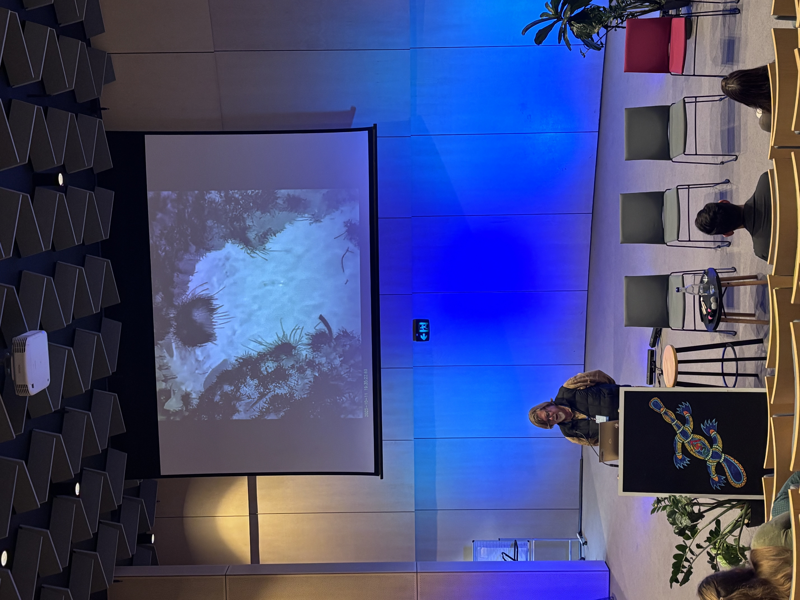

::: {.callout-note}
Oberon Citizen Science Network acknowledges the Traditional Owners of Country throughout Australia. The Oberon region is located on the territory of the Wiradjuri, Gundungurra and Dharug peoples who are the traditional custodians of the land on which we live, work and carry out our scientific enquiry. We pay our respects to Elders past and present and extend that respect to all Aboriginal and Torres Strait Islander peoples.
:::

::: {.aside}

:::

This video is a slightly longer version of a talk delivered by Tim Churches on behalf of Oberon Citizen Science Network on Thursday, 11th June 2026 at the 2026 Triennial Platypus Conference held at Taronga Zoo, Sydney.



